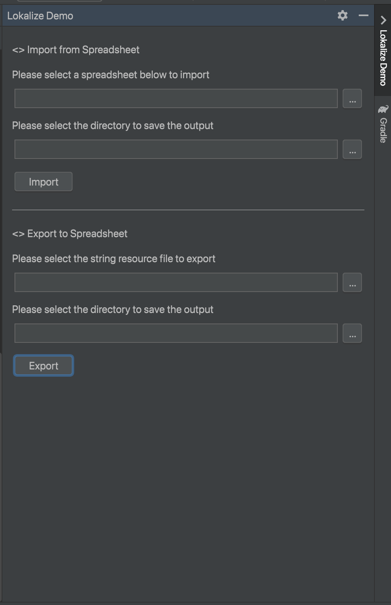

# StringLokalize Plugin

The StringLokalize Plugin simplifies the internationalization process in Android Studio and other IntelliJ-based IDEs.
It allows for seamless importing of string resources from a spreadsheet and exporting string resources to a spreadsheet.
This enhances collaboration with translation teams by providing an efficient way to manage language translations.

## Motivation

During a recent project, we encountered the necessity to incorporate support for a new language in our Android
application as part of our internationalization initiative. In response to this requirement, our translation team sought
a comprehensive list of all the application's strings in a spreadsheet format. This would facilitate the provision of
translations for the new language, neatly organized in a separate column within the spreadsheet.

Unfortunately, exporting the string.xml file directly to a spreadsheet from Android Studio proved to be a non-trivial
task. Additionally, the process of importing the spreadsheet back into the string.xml file within Android Studio lacked
a straightforward solution. It was these challenges that prompted the inception of the idea for this plugin.

## How do I get it?

### JetBrains Marketplace

Coming soon...

[//]: # (The plugin will be accessible to the public on the JetBrains marketplace. To install it, navigate to the plugin section)

[//]: # (within Android Studio under Preferences/Settings. Perform a search for StringLokalize and proceed to install and apply)

[//]: # (the plugin.)

### Build Locally

You have the option to clone the repository and execute the command `./gradlew buildPlugin` to produce
the
plugin. The resulting zip file can be found in the `build/distributions directory`. Subsequently, go to the plugin
section
within Android Studio under Preferences/Settings. Click on the settings icon, then proceed to "Install Plugin from Disk"
to complete the installation process.

## Okay, I get it. How do I use it?

### Importing string resources from spreadsheet

The plugin is compatible with both xls and xlsx spreadsheet formats. For proper functionality, ensure that the
spreadsheet contains a minimum of two columns. The first column header must be labeled as key, while the subsequent
columns should represent valid language locale codes (e.g., en, pt, tr, etc.). A sample spreadsheet template is included
in the project at `test/lokalize-template.xlsx`.

Upon selecting your spreadsheet file, proceed to specify the directory where you desire the string resources to be
generated. While the ideal location is within the res folder of your `app` module, you have the flexibility to choose
any
other module based on your project structure. Simply click on the import button and witness the magic unfold!

### Exporting string resources to a spreadsheet

Exporting a string resource file (strings.xml) to a spreadsheet is also possible. Simply indicate the XML file and
specify the directory where you wish the resulting spreadsheet to be generated. It's as straightforward as that. A
sample string.xml file is included
in the project at `test/strings.xml`

## Screenshot

